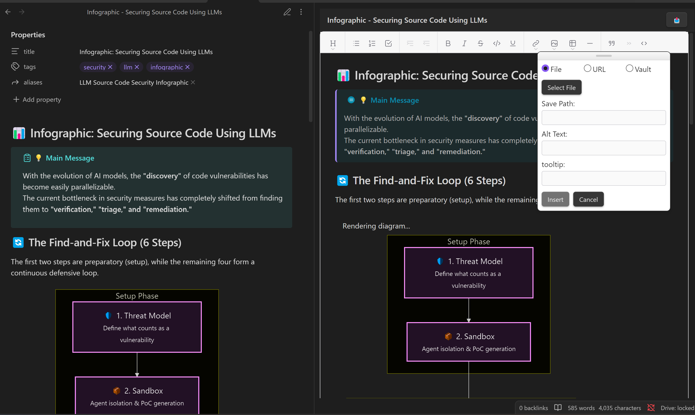
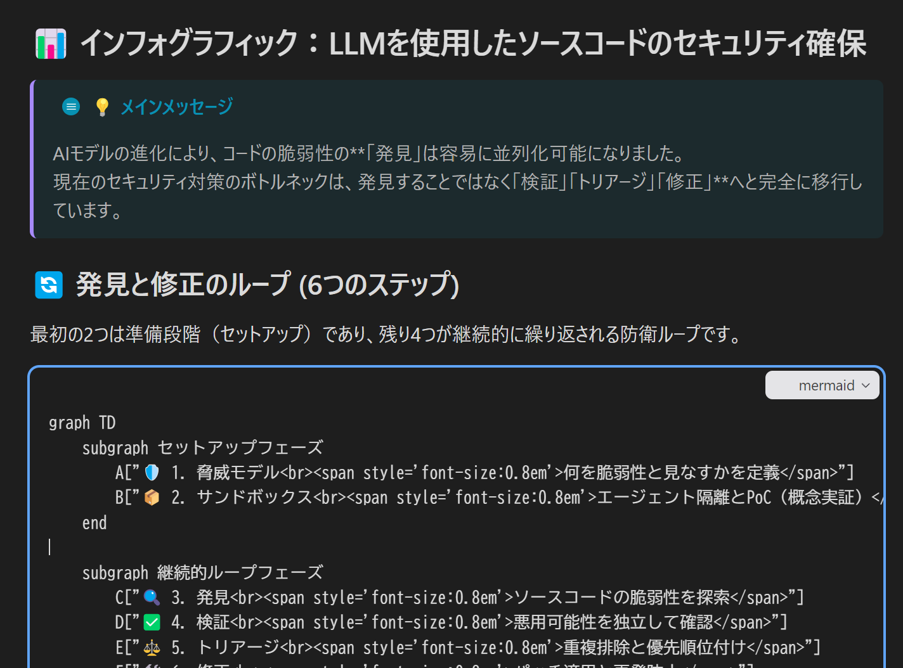
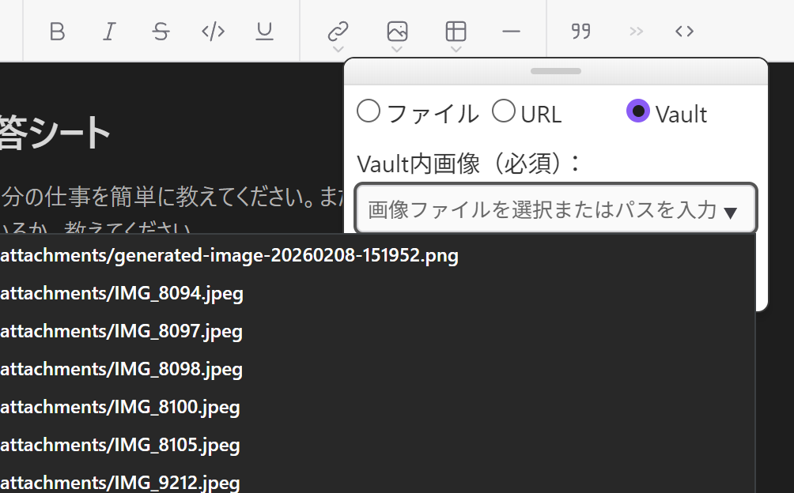

# Wysimark Editor for Obsidian

A modern WYSIWYG Markdown editor plugin for Obsidian. Edit your notes with a rich text interface while keeping pure Markdown.



## Features

### Rich Text Editing

Edit your Markdown files visually with a familiar word processor-like interface. The editor automatically converts between Markdown and rich text format.

### Markdown Saving

The vendored editor includes the Markdown preservation fixes from `wysimark-lite 1.0.0`. Repeated saves preserve code URLs, table cell content, line breaks, footnotes, internal links, and paragraphs or code within list items. Editor-only spacer paragraphs are omitted, and blank lines use ordinary newlines rather than non-breaking spaces. Table layout and list indentation may be normalized.

### Text Formatting

- **Bold** (`Ctrl/Cmd + B`)
- *Italic* (`Ctrl/Cmd + I`)
- ~~Strikethrough~~ (`Cmd + Option + K` / `Ctrl + Shift + K`)
- `Inline Code` (`Ctrl/Cmd + J`)
- <u>Underline</u> (`Ctrl/Cmd + U`)

Formatting buttons stay visible in narrow sidebars and highlight the formatting at the current cursor or selection. While the editor is focused, its formatting shortcuts take priority over Obsidian's global commands.

### Headings

- Heading 1 (`Cmd + Option + 1` / `Ctrl + Shift + 1`)
- Heading 2 (`Cmd + Option + 2` / `Ctrl + Shift + 2`)
- Heading 3 (`Cmd + Option + 3` / `Ctrl + Shift + 3`)
- Normal paragraph (`Cmd + Option + 0` / `Ctrl + Shift + 0`)

### Lists

- Bullet lists (`Cmd + Option + 8` / `Ctrl + Shift + 8`)
- Numbered lists (`Cmd + Option + 7` / `Ctrl + Shift + 7`)
- Task/Check lists (`Cmd + Option + 9` / `Ctrl + Shift + 9`)
- Increase indent (`Tab`)
- Decrease indent (`Shift + Tab`)

### Block Elements

- Block quotes (`Cmd + Option + .` / `Ctrl + Shift + .`)
- Code blocks with syntax highlighting (`Cmd/Ctrl + Shift + N`; press again to turn the block off)
- HTML blocks (iframe, video embeds, etc.) - displayed as read-only blocks and preserved as raw HTML
- Callouts (`> [!note]`, `> [!warning]`, etc.) rendered with their icon and color
- Mermaid code blocks rendered as live diagram previews



### Tables

- Insert tables from toolbar
- Navigate cells with `Tab` / `Shift+Tab`
- `Enter`: Insert line break within cell
- `Shift+Enter`: Move to next cell (adds new row at end)
- `Tab` at last cell: Exit table

### Links and Images

- Insert links (`Cmd + Option + K` / `Ctrl + Shift + K`) with text and tooltip
- Edit existing links (URL, text, and tooltip)
- Selected text becomes link text automatically
- Insert images from URL
- Insert images from local files (saved to vault)
- Insert images already in the vault via a searchable file picker



### Other Features

- **Frontmatter Support**: YAML frontmatter (properties) at the beginning of files is preserved but hidden from the editor
- **Auto-save**: Changes are automatically saved with a 1-second debounce
- **Reload button**: Click the 📥 button to reload the file from Obsidian (useful when the file is modified externally)

## Installation

### Community Plugins (Recommended)

1. Open Obsidian Settings
2. Go to Community plugins and disable Restricted mode
3. Click "Browse" and search for "Wysimark Editor"
4. Install and enable the plugin

Plugin page: https://community.obsidian.md/plugins/wysimark-editor

### Manual

1. Download `main.js`, `manifest.json`, `styles.css` from [releases](https://github.com/takeshy/obsidian-wysimark/releases)
2. Create `wysimark-editor` folder in `.obsidian/plugins/`
3. Copy files and enable in Obsidian settings

## Usage

1. Enable Wysimark Editor in Settings > Community plugins (installing alone does not enable it)
2. Open a Markdown file and click the pencil icon labeled "Wysimark editor" in the left ribbon to open the editor in the right sidebar. You can also run "Wysimark Editor: Toggle sidebar" from the command palette
3. Edit your content using the toolbar or keyboard shortcuts
4. Changes are saved automatically

If the icon is missing, check that the ribbon is visible and that "Wysimark editor" is enabled in the ribbon's right-click menu.

## Development

### Build Commands

```bash
# Development mode with watch (auto-rebuilds on changes)
npm run dev

# Production build with TypeScript type checking and minification
npm run build
```

### Technology Stack

- **Editor**: Wysimark (built on Slate.js + React)
- **UI Framework**: React 19 with Emotion for styling
- **Build**: esbuild

## Credits

This plugin is built using [Wysimark](https://github.com/portive/wysimark), an excellent open-source WYSIWYG Markdown editor. Special thanks to [@thesunny](https://github.com/thesunny) for creating and maintaining this fantastic library. Wysimark is licensed under the MIT License.

## License

MIT

## Author

takeshy
